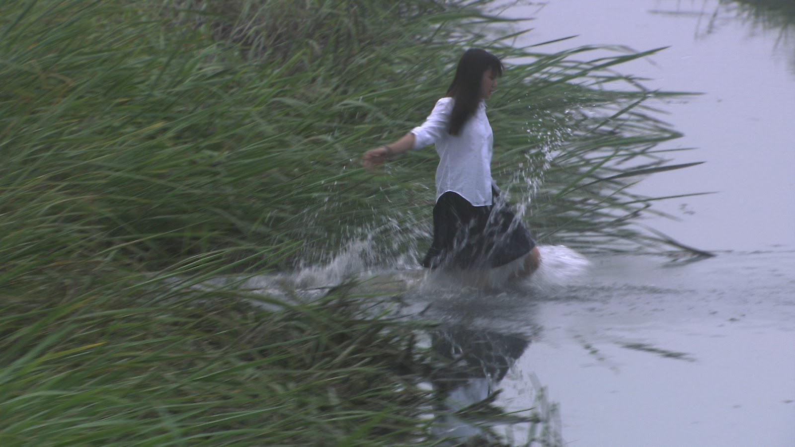
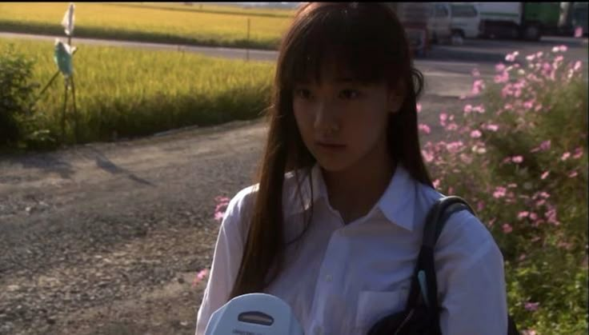

# Tsuda Shiori: The Silence Between Notes

This is not a technical project. It is a quiet room.

Open the door and you’ll find Tsuda Shiori—still, fragile, and listening to a world that refuses to slow down. This page is a small reflection on All About Lily Chou-Chou (2001), a film that drifts like a signal through static. Here, the words try to hold a silence; the images try to remember what the characters cannot say aloud.

## Who She Is

Shiori enters the story like a breath no one notices at first. She is not the loudest grief nor the easiest kindness. She is the pause between two notes—where the song becomes honest. In the film’s brittle landscape of cruelty and escape, she carries a private dignity that feels almost impossible. You want to protect it. You know you can’t.

## The Weight She Carries

There are many readings of her decision, and each one hurts in a different way:

- **A refusal of contamination**: a soft, final no to a world that punishes empathy.
- **The collapse of innocence**: when meaning is violated, what remains to hold?
- **A reaching toward the ideal**: Lily is less a singer than a ghost; Shiori, in leaving, touches that unreachable clarity.

None of these explanations comfort. They are not meant to. The point is not to solve her but to feel the silence that follows.

## Epilogue

When the last image fades, you don’t learn anything new about her. You only learn something about the distance between people, and how easily it widens in a world that forgets how to listen. Shiori is remembered not for action but for presence—the way a still lake remembers the sky.

## How to Read This Page

Take your time. Let the hero image breathe. Sit with the quotes. If the room feels dim, it’s on purpose. The writing asks for quiet, not answers.

## Author’s Note

This page was written and arranged with care, and with the help of tools that can hold language steady while it’s being shaped. The intention is simple: to make a small, respectful space for Shiori.

© 2025 Fadhil
